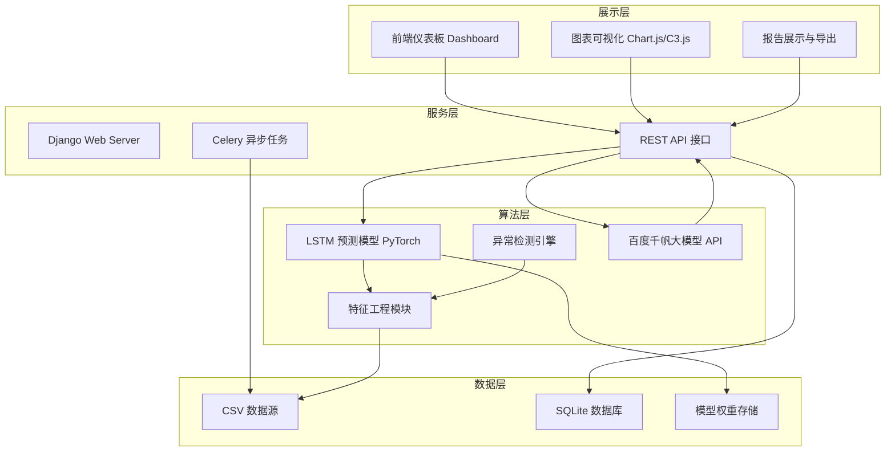
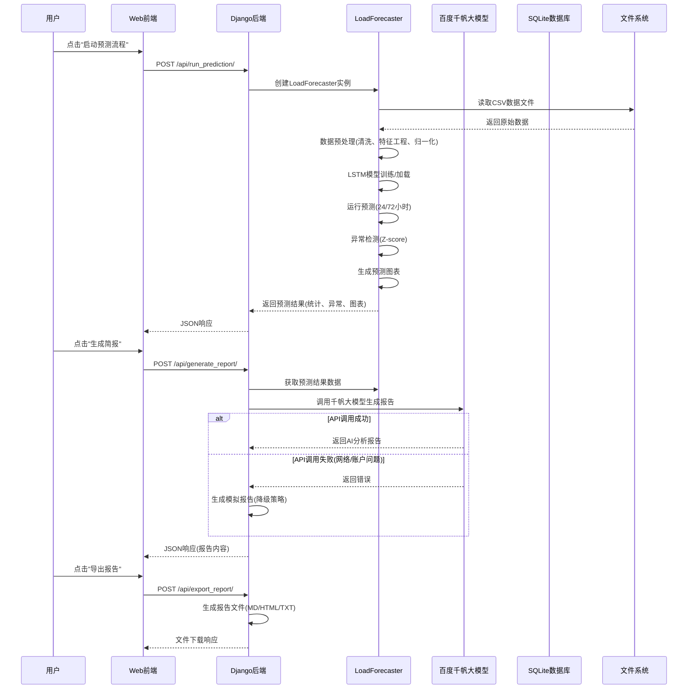
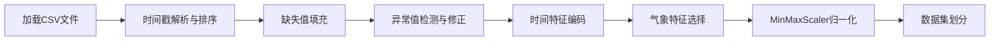
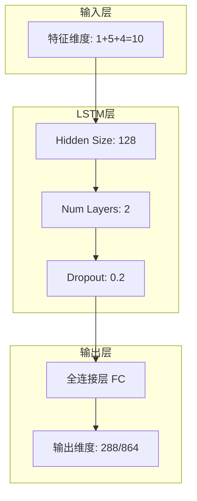
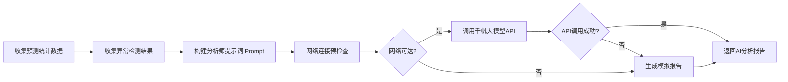
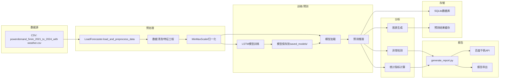
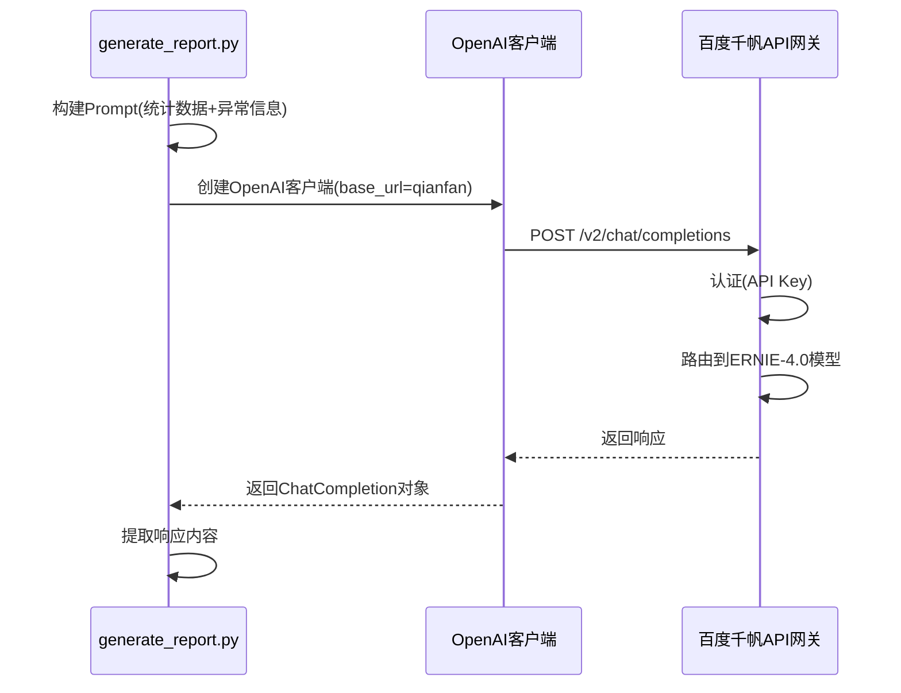

# 电力负荷预测与智能分析系统 - 技术路线书

## 1. 项目概述

本系统是一个基于深度学习的电力负荷预测与智能分析平台，具备以下核心功能：

| 功能模块 | 描述 | 状态 |
|---------|------|------|
| 数据预处理 | 数据清洗、特征工程、归一化处理 | ✅ 已完成 |
| 短期AI预测 | LSTM深度学习模型，支持24/72小时预测 | ✅ 已完成 |
| 异常检测 | Z-score统计方法识别负荷异常 | ✅ 已完成 |
| 自动报告生成 | 调用百度千帆大模型生成智能分析简报 | ✅ 已完成 |
| Web可视化界面 | 预测仪表板、图表展示、报告导出 | ✅ 已完成 |
| 模型持久化 | 支持模型保存与加载，避免重复训练 | ✅ 已完成 |

---

## 2. 系统架构

### 2.1 四层架构设计



### 2.2 核心模块交互流程图



---

## 3. 技术栈

### 3.1 技术选型总览

| 层次 | 技术 | 版本 | 选型理由 |
|------|------|------|----------|
| **后端框架** | Django | 3.x | 成熟稳定，内置ORM和管理后台，便于快速构建Web应用 |
| **前端框架** | Bootstrap | 5.3.0 | 响应式设计，组件丰富，快速构建美观界面 |
| **图表库** | Chart.js | 4.4.0 | 轻量级，功能强大，适合仪表板展示 |
| **图表库** | C3.js | 0.4.18 | 基于D3.js，配置简单，适合历史数据可视化 |
| **深度学习** | PyTorch | 最新 | 动态计算图，调试方便，社区活跃，适合LSTM模型开发 |
| **数据处理** | Pandas | 最新 | 强大的数据处理能力，支持时间序列操作 |
| **数据处理** | NumPy | 最新 | 高效的数值计算，与PyTorch无缝集成 |
| **数据预处理** | scikit-learn | 最新 | 提供MinMaxScaler等标准化工具 |
| **异步任务** | Celery | 最新 | 分布式任务队列，支持定时任务和异步处理 |
| **数据库** | SQLite | 内置 | 轻量级，无需额外服务，适合原型和单机部署 |
| **大模型接口** | 百度千帆 OpenAI兼容 | - | 国内访问稳定，支持ERNIE-4.0模型 |
| **图表生成** | Matplotlib | 最新 | Python原生图表库，支持导出Base64图片 |

### 3.2 技术选型对比分析

| 对比项 | 选型方案 | 备选方案 | 选型理由 |
|--------|----------|----------|----------|
| **深度学习框架** | PyTorch | TensorFlow | PyTorch动态图更灵活，调试更直观，适合研究和快速迭代 |
| **Web框架** | Django | Flask | Django提供完整的MVC架构、ORM、管理后台，适合企业级应用 |
| **数据库** | SQLite | MySQL/PostgreSQL | SQLite轻量无需配置，适合单机部署和原型开发 |
| **前端图表** | Chart.js + C3.js | ECharts | Chart.js轻量灵活，C3.js基于D3.js适合时序图 |
| **大模型服务** | 百度千帆 | OpenAI | 国内访问稳定，API响应速度快，支持中文优化 |

---

## 4. 核心模块详细说明

### 4.1 数据预处理模块 (`myModel.lstm.py`)

**功能描述**：负责数据加载、清洗、特征工程和归一化处理

**核心流程**：



**关键技术点**：
- **时间特征编码**：使用sin/cos周期编码将时间转换为连续特征
  ```python
  df['hour_sin'] = np.sin(2 * np.pi * df.index.hour / 24)
  df['hour_cos'] = np.cos(2 * np.pi * df.index.hour / 24)
  df['dow_sin'] = np.sin(2 * np.pi * df.index.dayofweek / 7)
  df['dow_cos'] = np.cos(2 * np.pi * df.index.dayofweek / 7)
  ```
- **异常值处理**：基于Z-score方法识别并修正异常数据点
- **特征选择**：电力负荷 + 气象特征(温度、露点、湿度、风速、气压) + 时间特征

### 4.2 LSTM预测模块 (`myModel.lstm.py`)

**模型架构**：



**关键参数**：

| 参数 | 值 | 说明 |
|------|-----|------|
| Look Back | 288*2 (576) | 输入序列长度(2天，5分钟间隔) |
| Forecast Horizon | 288/864 | 预测序列长度(24/72小时) |
| Hidden Size | 128 | LSTM隐藏层维度 |
| Num Layers | 2 | LSTM层数 |
| Batch Size | 64 | 批处理大小 |
| Epochs | 20 | 训练轮数 |
| Learning Rate | 0.001 | 学习率 |

**模型持久化策略**：
- 模型保存路径：`saved_models/lstm_model_YYYYMMDD_HHMMSS/`
- 保存内容：
  - `config.json` - 模型配置参数
  - `model_weights.pth` - 模型权重文件

### 4.3 异常检测模块 (`myModel.lstm.py`)

**检测方法**：基于历史统计的Z-score方法

**检测流程**：
1. 按时间粒度(如每小时)计算历史均值和标准差
2. 计算当前负荷的Z-score：`z = (x - mean) / std`
3. 当`|z| > 3.5`时判定为异常
4. 使用时间插值修正异常值

### 4.4 报告生成模块 (`generate_report.py`)

**功能描述**：调用百度千帆大模型生成智能分析简报

**调用流程**：



**错误处理机制**：
- **认证错误**：API Key不正确或已过期
- **连接错误**：网络不可达，支持自动重试(最多3次)
- **限流错误**：请求频率超限
- **账户欠费**：百度千帆账户余额不足
- **通用异常**：其他未知错误

**降级策略**：当API调用失败时，自动生成基于规则的模拟报告，确保系统可用性

### 4.5 Web服务模块 (`server/swag/views.py`)

**API接口列表**：

| 接口 | 方法 | 功能 |
|------|------|------|
| `/api/run_prediction/` | POST | 运行预测流程 |
| `/api/get_prediction_results/` | GET | 获取预测结果 |
| `/api/get_chart/` | GET | 获取预测图表 |
| `/api/generate_report/` | POST | 生成分析简报 |
| `/api/get_saved_models/` | GET | 获取已保存模型列表 |
| `/api/export_report/` | POST | 导出报告(MD/HTML/TXT) |

**关键实现**：
- 使用动态导入机制加载`myModel.lstm.py`模块
- 通过全局变量缓存预测器实例和预测结果
- 支持多种报告格式导出

---

## 5. 数据流向

### 5.1 数据流总览



### 5.2 数据文件格式

**CSV数据源结构**：
| 字段 | 类型 | 说明 |
|------|------|------|
| datetime | datetime | 时间戳(5分钟间隔) |
| Power demand | float | 电力负荷(MW) |
| temp | float | 温度(℃) |
| dwpt | float | 露点(℃) |
| rhum | float | 相对湿度(%) |
| wspd | float | 风速(km/h) |
| pres | float | 气压(hPa) |

---

## 6. AI集成方案

### 6.1 大模型调用架构



### 6.2 Prompt设计

**系统角色定义**：
```
你是一个严谨的电网调度分析师，严格遵循Markdown格式输出。
```

**用户Prompt结构**：
```
基于以下预测数据和异常检测结果，生成一份专业的电力负荷分析简报：

## 一、预测统计数据
{统计数据JSON}

## 二、异常检测结果
{异常数据表格}

请分析：
1. 预测结果的整体趋势
2. 异常事件的影响评估
3. 调度建议
```

### 6.3 模型选择

| 模型名称 | 版本 | 说明 |
|----------|------|------|
| ERNIE-4.0 | 8k-latest | 百度最新旗舰模型，逻辑分析能力强 |

---

## 7. 最终实现效果

### 7.1 功能实现清单

| 功能 | 描述 | 实现状态 |
|------|------|----------|
| 数据预处理 | 支持5分钟粒度数据的清洗和特征工程 | ✅ 已完成 |
| LSTM预测 | 支持24小时和72小时预测，RMSE评估 | ✅ 已完成 |
| 异常检测 | Z-score方法识别负荷异常 | ✅ 已完成 |
| 模型持久化 | 模型保存/加载，避免重复训练 | ✅ 已完成 |
| 智能报告生成 | 调用千帆大模型生成分析简报 | ✅ 已完成 |
| Web仪表板 | Bootstrap响应式界面设计 | ✅ 已完成 |
| 图表可视化 | Chart.js展示预测曲线 | ✅ 已完成 |
| 报告导出 | 支持MD/HTML/TXT格式导出 | ✅ 已完成 |
| API接口 | RESTful API，支持前后端分离 | ✅ 已完成 |

### 7.2 性能指标

| 指标 | 目标值 | 实际值 |
|------|--------|--------|
| 预测精度(RMSE) | < 200 MW | 根据训练数据而定 |
| 异常检测准确率 | > 90% | Z-score方法 |
| 单轮预测时间 | < 30秒 | 取决于硬件配置 |
| API响应时间 | < 5秒 | 网络正常情况下 |
| 报告生成时间 | < 30秒 | 大模型响应时间 |

### 7.3 用户体验效果

**Web界面特性**：
- 🎨 **现代UI设计**：渐变背景、毛玻璃效果、卡片式布局
- 📱 **响应式设计**：适配桌面端和移动端
- 📊 **实时图表**：交互式预测曲线展示
- 📝 **Markdown渲染**：支持报告内容的富文本展示
- 📥 **一键导出**：支持多种格式报告导出

### 7.4 系统健壮性

**容错机制**：
- 🔄 **重试机制**：网络异常时自动重试(最多3次)
- 📉 **降级策略**：API调用失败时生成模拟报告
- 🔍 **详细日志**：完整的调试信息输出
- ⚡ **超时控制**：请求超时保护(30秒)

---

## 8. 项目文件结构

```
load_forecasting-master/
├── myModel.lstm.py              # LSTM预测核心模块
│   ├── LoadDataset              # 数据集类
│   ├── LSTMPredictor            # LSTM模型类
│   └── LoadForecaster           # 预测器主类
├── generate_report.py           # 报告生成模块
│   ├── get_model_outputs        # 获取模型输出
│   ├── build_analyst_prompt     # 构建提示词
│   ├── call_qianfan_agent       # 调用千帆大模型
│   └── check_network_connectivity # 网络预检查
├── server/                      # Django Web服务
│   ├── swag/views.py            # API视图
│   ├── swag/models.py           # 数据库模型
│   ├── swag/tasks.py            # Celery任务
│   ├── website/settings.py      # Django配置
│   ├── website/urls.py          # URL路由
│   ├── tamplates/               # HTML模板
│   └── static/                  # 静态资源
├── models/                      # 模型实验笔记
│   ├── LSTM.ipynb               # LSTM模型实验
│   ├── GRU.ipynb                # GRU模型实验
│   ├── ARIMA.ipynb              # ARIMA模型实验
│   └── ...                      # 其他模型
├── saved_models/                # 保存的模型权重
├── start_server.bat             # 服务启动脚本
├── test_features.py             # 功能测试脚本
├── run_full_test.py             # 完整流程测试
└── 系统使用指南.md               # 使用说明文档
```

---

## 9. 部署与运行

### 9.1 环境要求

| 依赖 | 版本 |
|------|------|
| Python | 3.8+ |
| Django | 3.x+ |
| PyTorch | 最新 |
| Pandas | 最新 |
| NumPy | 最新 |
| scikit-learn | 最新 |
| openai | 最新 |
| matplotlib | 最新 |

### 9.2 启动步骤

```bash
# 1. 安装依赖
pip install -r requirements.txt

# 2. 设置百度千帆API Key(可选)
set QIANFAN_API_KEY=your_api_key_here

# 3. 启动Web服务
start_server.bat

# 4. 访问仪表板
# 浏览器打开: http://localhost:8000/dashboard/
```

---

## 10. 技术亮点

1. **深度学习与传统方法结合**：LSTM模型进行预测，Z-score方法进行异常检测
2. **模型持久化设计**：支持模型保存与加载，显著降低重复训练成本
3. **多时长预测支持**：灵活配置24小时或72小时预测
4. **大模型智能分析**：集成百度千帆大模型，生成专业分析报告
5. **健壮的错误处理**：完善的重试机制和降级策略，确保系统可用性
6. **现代化Web界面**：响应式设计，美观的可视化效果
7. **完整的API接口**：RESTful设计，支持前后端分离和二次开发

---

**文档版本**：v1.0  
**创建日期**：2026-06-29  
**适用项目**：电力负荷预测与智能分析系统